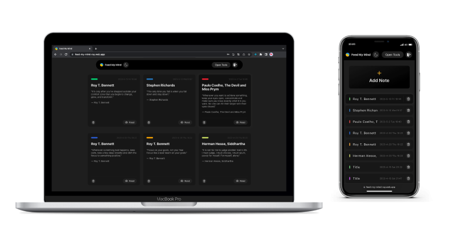
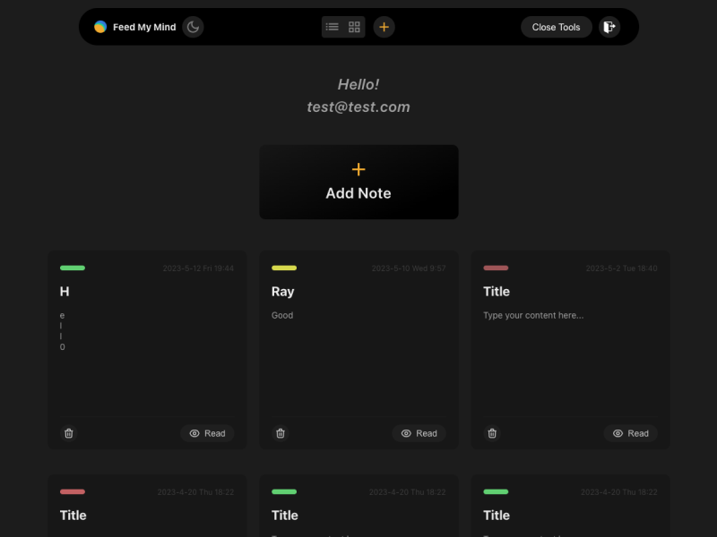
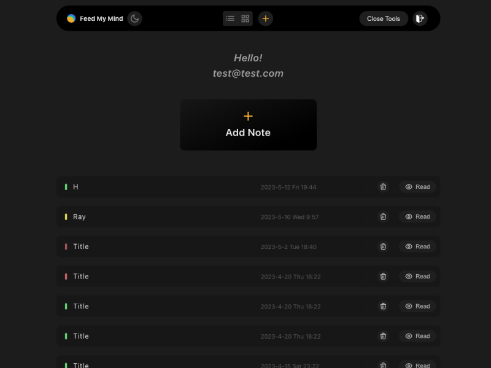
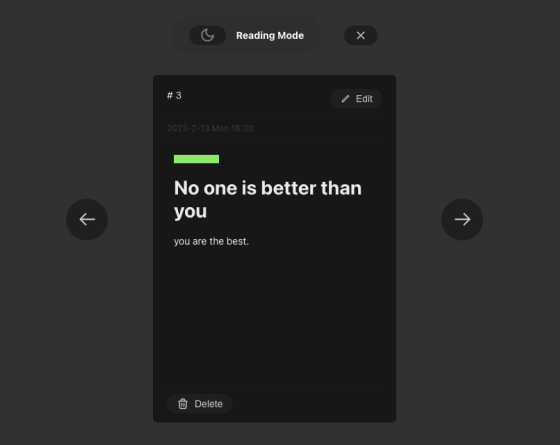
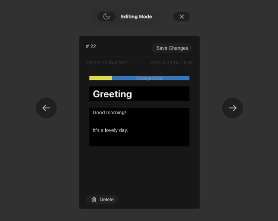

# Feed My Mind

A note-taking web app developed by React.

## Demo

👉 Live demo：[Feed My Mind](https://feed-my-mind-ray.web.app)
- account: test@gmail.com
- password: 123456

## Features

- Create a new note with text content and color selected.
- Edit notes effectively with one click to toggle read/edit mode.
- Timestamp auto-generated with created time and edited time (if edited).
- Switch between notes in reading mode (without back to panel).
- Change view mode: list view & grid view.
- Create your own account to store your own notes.
- RWD layout.

## Preview

### Grid view

 
### List view

 
### Reading mode

 
### Creating/Editing mode

 

## Techniques

- Front-End Fundamental
  - React / React Hooks
  - HTML / CSS / JavaScript
  - Responsive Web Design (RWD)
- Cloud Services：Google Firebase
  - Firestore Database
  - Authentication
  - Hosting
- Packages
  - styled-components
  - react-icons
  - uuid
- Other
  - Tool: ESLint
  - Version Control: Git / GitHub

## Contact

Ray Huang / ray.mj.huang@gmail.com

